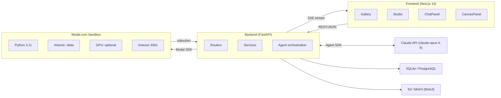
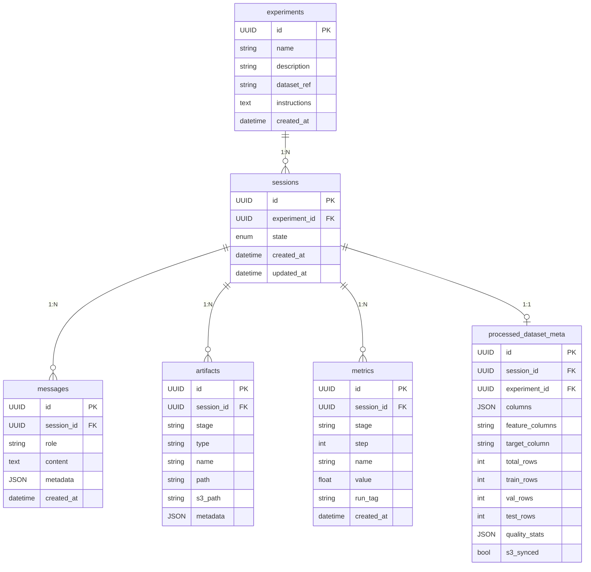
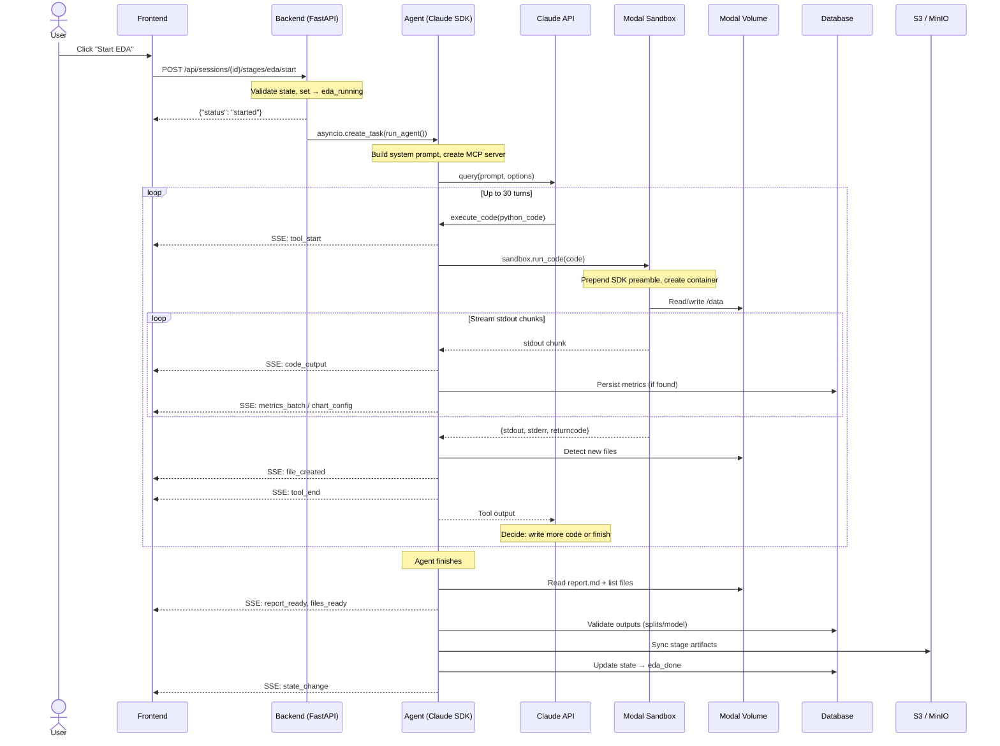
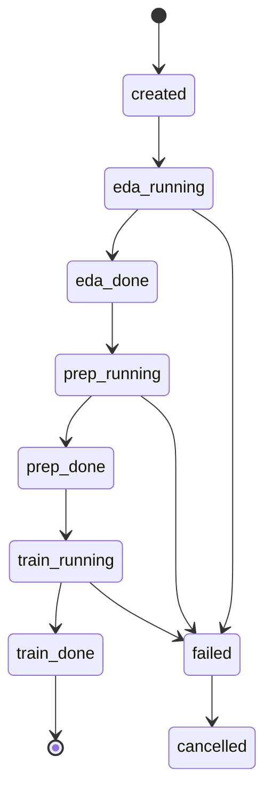

# Architecture

> **C4 diagrams:** see [`diagrams/`](diagrams/) for a top-down Excalidraw set (Context → Containers → Components → Code), including a dedicated view of the multi-agent subsystem.
>
> Legacy interactive diagram: [`architecture.excalidraw`](architecture.excalidraw) (single-page overview, kept for backwards compatibility).

## System Overview

Trainable is a three-tier application: a Next.js frontend, a FastAPI backend, and Modal sandboxes for isolated code execution. An AI agent (Claude) drives the ML workflow autonomously while the user observes via real-time streaming.



## Tech Stack

| Layer | Technology | Purpose |
|-------|-----------|---------|
| Frontend | Next.js 14, React 18, TypeScript, Tailwind | UI: gallery, studio, live charts |
| Backend | FastAPI, SQLAlchemy (async), Python 3.11 | API, agent orchestration, SSE |
| AI Agent | Claude Agent SDK, custom MCP server | Autonomous code generation + execution |
| Execution | Modal (sandboxes + volumes) | Isolated Python containers, optional GPU |
| Database | SQLite (dev) / PostgreSQL (prod) | Experiments, sessions, messages, artifacts, metrics |
| Object Storage | S3 / MinIO | Dataset uploads, artifact persistence |
| Real-time | Server-Sent Events (SSE) | Stream agent output to browser |

---

## Database Schema

Six tables managed by async SQLAlchemy ORM (`backend/models.py`):



### Table Details

**experiments** — Top-level entity. One per uploaded dataset.
- `id` (UUID): primary key
- `dataset_ref` (string): S3 URI pointing to uploaded files
- `instructions` (text): user-provided guidance passed to agents

**sessions** — One execution run of the EDA→Prep→Train pipeline.
- `state` (enum): `created → eda_running → eda_done → prep_running → prep_done → train_running → train_done | failed | cancelled`
- An experiment can have multiple sessions (re-runs)

**messages** — Chat history between user and agent.
- `role`: `user`, `assistant`, `tool`, or `system`
- `metadata_` (JSON): event type, tool input/output, stage info

**artifacts** — Files generated during each stage.
- `stage`: `eda`, `prep`, or `train`
- `artifact_type`: `report`, `chart`, `dataset`, `model`, `script`, `metadata`, `file`
- `path`: Modal Volume path; `s3_path`: S3 URI (set after sync)

**metrics** — Training metrics for live dashboard.
- `step` (int): iteration/epoch number
- `name` (string): metric name (e.g., `train_loss`, `val_accuracy`)
- `value` (float): metric value
- `run_tag` (string, optional): model name for multi-model comparison

**processed_dataset_meta** — Extracted after prep stage (1:1 with session).
- `columns`, `feature_columns`, `target_column`: schema info
- `total_rows`, `train_rows`, `val_rows`, `test_rows`: split sizes
- `quality_stats` (JSON): missing values, duplicates, etc.

---

## How Modal Sandboxes Are Triggered

The full execution path from user click to sandbox execution:



### Modal Volume Structure

The Modal Volume `trainable-data` is mounted at `/data` inside sandboxes:

```
/data/
├── datasets/
│   └── {experiment_id}/
│       ├── raw_data.csv              ← uploaded by user
│       └── other_files.parquet
└── sessions/
    └── {session_id}/
        ├── eda/
        │   ├── report.md             ← agent-generated
        │   ├── figures/*.png
        │   ├── data/*.csv
        │   └── scripts/step_01_*.py  ← auto-saved by backend
        ├── prep/
        │   ├── data/
        │   │   ├── train.parquet
        │   │   ├── val.parquet
        │   │   ├── test.parquet
        │   │   ├── metadata.json
        │   │   └── prep_pipeline.pkl
        │   ├── report.md
        │   └── scripts/
        └── train/
            ├── models/model.pkl
            ├── data/metadata.json
            ├── figures/
            ├── report.md
            └── scripts/
```

### Modal Image (Sandbox Environment)

Built once, cached by Modal. Defined in `sandbox.py:_get_image()`:

```python
modal.Image.debian_slim(python_version="3.11")
    .pip_install("pandas", "numpy", "matplotlib", "seaborn",
                 "scikit-learn", "xgboost", "lightgbm",
                 "pyarrow", "openpyxl", "duckdb",
                 "imbalanced-learn", "optuna", "category_encoders",
                 "pandera", "shap", "statsmodels")
    .pip_install("torch", "torchvision", "torchaudio",
                 index_url="https://download.pytorch.org/whl/cpu")
    .pip_install("tensorflow-cpu")
```

### Trainable SDK (Injected into Sandbox)

Every code execution gets `_SDK_PREAMBLE` prepended, which creates a `trainable` Python module:

```python
from trainable import log, configure_dashboard

# Configure live charts (once)
configure_dashboard([
    {"title": "Loss", "metrics": ["train_loss", "val_loss"], "type": "line"},
])

# Log metrics every iteration (streams to frontend instantly)
log(step=epoch, metrics={"train_loss": 0.5, "val_loss": 0.6}, run="xgboost")
```

Under the hood: `log()` prints JSON to stdout → sandbox streams it → `metrics.py` parses it → persists to `metrics` table → publishes SSE → frontend MetricsTab renders Recharts.

---

## Directory Structure

```
trainable-monorepo/
├── backend/
│   ├── main.py                    # FastAPI app, CORS, lifecycle
│   ├── db.py                      # Async SQLAlchemy engine + session
│   ├── models.py                  # ORM models (6 tables)
│   ├── schemas.py                 # Pydantic request/response schemas
│   ├── routers/
│   │   ├── experiments.py         # CRUD experiments, file upload
│   │   ├── sessions.py            # Session management, stage triggers, messages
│   │   ├── stream.py              # SSE endpoint
│   │   ├── files.py               # Serve files from Modal Volume
│   │   ├── s3_browser.py          # Browse S3 buckets
│   │   └── data_explorer.py       # DuckDB SQL queries on processed data
│   ├── services/
│   │   ├── agent.py               # Claude Agent SDK orchestration, stage prompts
│   │   ├── sandbox.py             # Modal sandbox creation + code execution
│   │   ├── mcp_tools.py           # Custom MCP server (execute_code tool)
│   │   ├── broadcaster.py         # In-memory SSE pub/sub per session
│   │   ├── metrics.py             # Parse + persist training metrics from stdout
│   │   ├── validator.py           # Validate prep/train stage outputs
│   │   ├── s3_sync.py             # Sync stage artifacts to S3
│   │   └── metadata_extractor.py  # Extract dataset metadata post-prep
│   └── tests/
├── frontend/
│   ├── src/app/                   # Pages (gallery, studio)
│   ├── src/components/            # React components
│   └── src/lib/                   # API client, SSE, types
├── docs/
│   ├── agents.md                  # Detailed agent documentation
│   └── architecture.excalidraw    # Interactive architecture diagram
├── docker-compose.yml             # PostgreSQL + MinIO + Backend + Frontend
├── .github/workflows/ci.yml      # CI: lint, test, security, build
└── .env.example
```

## Communication Patterns

| Direction | Protocol | When |
|-----------|----------|------|
| Frontend → Backend | REST (JSON) | User actions: create experiment, start stage, send message |
| Backend → Frontend | SSE (streaming) | Agent output: text, code execution, metrics, files |
| Backend → Modal | Modal SDK (`Sandbox.create.aio`) | Sandbox creation, code execution, volume I/O |
| Backend → Claude | Claude Agent SDK (`query()`) | Agent loop: prompt → code gen → tool call → repeat |
| Backend → S3 | Boto3 | Dataset upload, artifact sync |
| Backend → DB | SQLAlchemy async | All state persistence |

## SSE Event Types

| Event | Source | Data |
|-------|--------|------|
| `state_change` | sessions.py | `{state}` |
| `agent_message` | agent.py | `{text}` |
| `tool_start` | agent.py | `{tool, input}` |
| `tool_end` | agent.py | `{tool, output}` |
| `code_output` | sandbox.py | `{stream, text}` |
| `file_created` | agent.py | `{path, name, stage}` |
| `report_ready` | agent.py | `{content, stage}` |
| `files_ready` | agent.py | `{files[], stage}` |
| `metrics_batch` | metrics.py | `{items[{step, name, value, stage, run_tag}]}` |
| `chart_config` | metrics.py | `{charts[{title, metrics, type}]}` |
| `validation_result` | agent.py | `{passed[], warnings[], errors[]}` |
| `s3_sync_complete` | agent.py | `{files_synced, s3_prefix}` |

## Agent Architecture

Three stage agents share a common execution pipeline but have different system prompts:

| Agent | Purpose | Key Output |
|-------|---------|------------|
| **EDA** | Explore data quality, distributions, correlations | report.md, figures/*.png |
| **Prep** | Clean, transform, split into train/val/test | train.parquet, val.parquet, test.parquet, metadata.json |
| **Train** | Train models, tune hyperparameters, evaluate | model.pkl, metrics, SHAP plots |

See [agents.md](agents.md) for detailed agent documentation.

## Session State Machine



Each stage requires the previous one to complete. The backend enforces this in `sessions.py:start_stage()`.

## Security

- **SQL injection prevention**: Data explorer validates SELECT-only queries, blocks DDL/DML, disables `enable_external_access` in DuckDB
- **Path traversal prevention**: File endpoints validate paths stay within `/sessions/` and `/datasets/` prefixes
- **Sandbox isolation**: All user-generated code runs in ephemeral Modal containers, not on the backend
- **CORS**: Configured in FastAPI middleware (currently allows all origins for development)

## Deployment Modes

### Local Development (SQLite)

No external dependencies except Modal and Anthropic API keys. SQLite is used as the database.

```bash
cd backend && uvicorn main:app --reload
cd frontend && npm run dev
```

### Docker Compose (PostgreSQL + MinIO)

Full stack with PostgreSQL for the database and MinIO for S3-compatible object storage.

```bash
docker compose up
```

### Environment Variables

| Variable | Required | Description |
|----------|----------|-------------|
| `ANTHROPIC_API_KEY` | Yes | Claude API key for the agent |
| `MODAL_TOKEN_ID` / `MODAL_TOKEN_SECRET` | Yes | Modal auth (or use `modal token set`) |
| `DATABASE_URL` | No | PostgreSQL URL (defaults to SQLite) |
| `S3_ENDPOINT` | No | S3/MinIO endpoint (defaults to AWS) |
| `AWS_ACCESS_KEY_ID` / `AWS_SECRET_ACCESS_KEY` | No | S3 credentials |
| `CLAUDE_MODEL` | No | Model override (defaults to `claude-opus-4-6`) |
