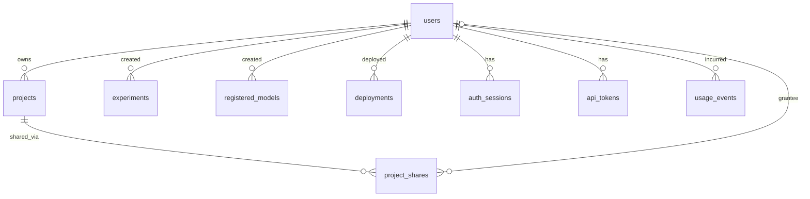

# Design: Multi-user auth, ownership, and sharing (#113)

**Status:** Proposed (design only — no code in this PR)
**Issue:** [#113](https://github.com/lucastononro/trainable/issues/113)
**Builds on:** [#88](https://github.com/lucastononro/trainable/issues/88) / [PR #138](https://github.com/lucastononro/trainable/pull/138) (opt-in `API_AUTH_TOKEN` bearer middleware), [#121](https://github.com/lucastononro/trainable/issues/121) / [PR #153](https://github.com/lucastononro/trainable/pull/153) (Alembic migrations)

---

## 1. Current state (what the code says today)

- **No user model.** `backend/models.py` has `Project → {Session, Experiment, DatasetVersion, RegisteredModel}` and `RegisteredModel → Deployment`, but no `users` table and no `user_id`/`owner_id` column anywhere. String(36) UUID PKs on Project/Session/Experiment/RegisteredModel/Deployment; ISO-8601 string timestamps.
- **No auth on routers.** `backend/main.py` mounts 15 routers under `/api` with only `Depends(get_db)`; CORS is `allow_origins=["*"]` **with** `allow_credentials=True` (`config.py: cors_origins`). PR #138 adds an opt-in, instance-wide shared bearer token (`backend/auth.py`, pure-ASGI middleware, `?token=` accepted on the SSE stream path only). That gates *access to the instance*, not *identity* — every caller is equivalent.
- **No ownership filtering.** e.g. `routers/projects.py: list_projects` returns every project; `routers/usage.py: /usage/summary` is a global rollup; `routers/files.py` and `s3_browser.py` expose the whole volume/bucket namespace.
- **Cost attribution stops at session/project.** `services/usage.py` writes `usage_events` rows keyed by `session_id` (+ denormalized `project_id`); there is no person to attribute spend to.
- **Frontend is identity-free.** `frontend/src/lib/api.ts` is a bare `fetch('/api/...')` with no credentials/headers; `AppContext.tsx` keeps the active project in `localStorage`; the project gallery (sidebar + project pages) and the `/usage` cost dashboard show everything on the instance. SSE uses `EventSource` (`app/page.tsx`, `lib/notebook/useNotebookSSE.ts`), which cannot set headers.
- **Migrations.** PR #153 replaces boot-time `_run_migrations` with Alembic (initial revision `0bae8e0f765d`). All schema work below is expressed as Alembic revisions on top of that chain. **PR #153 is a hard prerequisite for this design.**

## 2. Goals / non-goals

**Goals**
1. Real user identity (login), replacing "anyone with the shared token is root".
2. Per-object ownership (`owner_id`) on the four top-level user-facing entities: `Project`, `Experiment`, `RegisteredModel`, `Deployment`.
3. Authorization: reusable per-object access checks; list endpoints filter to what the caller may see.
4. Sharing: share-by-link and instance-visible ("team") objects, so cost dashboards and lineage become per-user without killing collaboration.
5. Per-user cost attribution in `usage_events` and the `/usage` dashboard.
6. **Zero-breakage rollout**: the current single-tenant, no-auth localhost mode must keep working, exactly as PR #138 kept `API_AUTH_TOKEN` opt-in.

**Non-goals (this design)**
- Fine-grained RBAC (viewer/editor/admin roles per object). We ship owner + share grants; roles can layer on later.
- Organizations / multiple teams per instance. One instance = one implicit team.
- Row-level security in the DB. Enforcement is at the FastAPI dependency layer.
- Quota/billing enforcement (attribution only).

## 3. Data model

### 3.1 `users`

```python
class User(Base):
    __tablename__ = "users"

    id = Column(String(36), primary_key=True)              # UUID, matches existing PK style
    email = Column(String(255), nullable=False, unique=True, index=True)
    display_name = Column(String(255), nullable=False, default="")
    # Local-password mode: argon2id hash. NULL for SSO-only users and for
    # the system "default owner" user.
    password_hash = Column(String(255), nullable=True)
    # SSO subject claim ("<issuer>|<sub>") when OIDC is enabled. NULL otherwise.
    sso_subject = Column(String(512), nullable=True, unique=True)
    is_admin = Column(Boolean, nullable=False, default=False)
    is_active = Column(Boolean, nullable=False, default=True)
    created_at = Column(String, default=lambda: utcnow().isoformat())
    updated_at = Column(String, default=lambda: utcnow().isoformat())
```

Notes:
- String PK + ISO-string timestamps deliberately match every existing table — no new conventions.
- `is_admin` gives ops an escape hatch (sees everything, manages users). First created user becomes admin (same pattern as most self-hosted tools).

### 3.2 Auth credential tables

```python
class AuthSession(Base):                 # browser cookie sessions
    __tablename__ = "auth_sessions"
    id = Column(String(64), primary_key=True)          # token_hex(32); value stored hashed (sha256)
    user_id = Column(String(36), ForeignKey("users.id", ondelete="CASCADE"),
                     nullable=False, index=True)
    expires_at = Column(String, nullable=False)        # ISO; sliding renewal on use
    created_at = Column(String, default=...)
    last_seen_at = Column(String, nullable=True)
    user_agent = Column(String(512), nullable=True)

class ApiToken(Base):                    # per-user PATs for CLI/scripts (replaces shared API_AUTH_TOKEN long-term)
    __tablename__ = "api_tokens"
    id = Column(String(36), primary_key=True)
    user_id = Column(String(36), ForeignKey("users.id", ondelete="CASCADE"),
                     nullable=False, index=True)
    name = Column(String(255), nullable=False, default="")
    token_hash = Column(String(64), nullable=False, unique=True, index=True)  # sha256 of "tr_<random>"
    expires_at = Column(String, nullable=True)
    created_at = Column(String, default=...)
    last_used_at = Column(String, nullable=True)
```

DB-backed sessions (not stateless JWT): trivially revocable, no key management, and the deployment is a single backend instance with a DB already in the hot path. Store only hashes of session/PAT secrets, per the Greptile log-leak note on PR #138.

### 3.3 Ownership FKs

Add to `Project`, `Experiment`, `RegisteredModel`, `Deployment`:

```python
owner_id = Column(String(36), ForeignKey("users.id"), nullable=False, index=True)
```

- **`Project.owner_id` is the authoritative ownership root.** Sessions, dataset versions, messages, artifacts, metrics, snapshots etc. do **not** get their own `owner_id` — they inherit access through their project (they already all reach a project via existing FKs). This keeps the authz model one rule deep.
- **`Experiment.owner_id` / `RegisteredModel.owner_id` = creator attribution.** On a shared project, "who ran this experiment / registered this model" is a product requirement (issue #113's "attribute cost/experiments to people"). It is *attribution*, not an independent access boundary: access checks still resolve through the project (plus shares). This avoids the incoherent state "I can see the experiment but not its project".
- **`Deployment.owner_id` = who deployed.** Deployments carry Modal API keys and cost; the person who pressed Deploy matters for audit. Access still resolves via `deployment.model.project`.
- `ondelete` for owner FKs: **RESTRICT** (default). Deleting a user must first reassign their objects (admin action "transfer ownership"), never cascade-delete a project tree or null out attribution.

### 3.4 Sharing

```python
class ProjectShare(Base):
    __tablename__ = "project_shares"
    id = Column(Integer, primary_key=True, autoincrement=True)
    project_id = Column(String(36), ForeignKey("projects.id", ondelete="CASCADE"),
                        nullable=False, index=True)
    # Exactly one of the two below is set:
    user_id = Column(String(36), ForeignKey("users.id", ondelete="CASCADE"),
                     nullable=True, index=True)      # direct grant to a user
    link_token_hash = Column(String(64), nullable=True, unique=True)  # share-by-link
    can_write = Column(Boolean, nullable=False, default=False)
    created_by = Column(String(36), ForeignKey("users.id"), nullable=False)
    created_at = Column(String, default=...)
```

Plus one column on `Project`:

```python
visibility = Column(String(10), nullable=False, default="private")  # "private" | "instance"
```

- `visibility="instance"` = team visibility: every authenticated user on the instance can **read** the project (the one-team-per-instance model). Owner + explicit `can_write` shares can write.
- Share-by-link mints a random token; the link is `/share/<token>` on the frontend, which exchanges it for a grant (logged-in user → persistent `ProjectShare(user_id=...)` row) or a read-only browsing session. Tokens stored hashed; revocable by deleting the row.
- Sharing is **project-granularity only** in v1. Sharing a single experiment/model out of a private project is deferred (open question 10.3) — lineage, files, and datasets all traverse the project, so sub-project shares leak siblings through every adjacent endpoint unless each one grows its own filter.

### 3.5 Cost attribution

`UsageEvent` gains:

```python
user_id = Column(String(36), ForeignKey("users.id"), nullable=True, index=True)
```

Nullable forever: system/legacy events may have no acting user. `services/usage.py: record_llm_usage / record_sandbox_usage` take the acting user from the request context (the session-runner already threads session → the run was started by an authenticated request; carry `user_id` alongside `session_id` in the run context). Rollups in `routers/usage.py` gain a `group_by=user` dimension.

### 3.6 ER delta



## 4. Authentication

### 4.1 Mode ladder (config)

One new setting, superseding-but-compatible-with PR #138:

```
AUTH_MODE = "none" | "token" | "multi_user"     (default: "none")
```

- **`none`** — today's behavior, byte-for-byte. No middleware, no `users` semantics enforced. Localhost dev default.
- **`token`** — exactly PR #138: shared `API_AUTH_TOKEN` bearer gate. Kept as the "I just want a padlock on my exposed instance" mode; `API_AUTH_TOKEN` set implies `AUTH_MODE=token` for back-compat.
- **`multi_user`** — this design: login required, identity resolved, ownership enforced.

### 4.2 Identity mechanisms in `multi_user` mode

| Client | Mechanism | Why |
|---|---|---|
| Browser (Next.js UI) | **HttpOnly session cookie** (`trainable_session`, `SameSite=Lax`, `Secure` when HTTPS), set by `POST /api/auth/login`, backed by `auth_sessions` | Cookies flow automatically on `fetch` **and on `EventSource`** — the SSE problem disappears for the browser (see 4.4). HttpOnly keeps the secret out of JS/localStorage. |
| CLI / scripts / MCP | **Per-user PAT**: `Authorization: Bearer tr_<token>` checked against `api_tokens` | Same wire shape as PR #138, so `cli/` and any existing scripts change nothing but the token value. |
| SSO (optional, later) | **OIDC authorization-code flow** (`/api/auth/oidc/login` → provider → `/api/auth/oidc/callback` → mint the same session cookie) | Auth-lib choice (e.g. `authlib`) is an implementation detail; the session layer is identical either way, so local-password and SSO users are indistinguishable past login. |

Passwords: argon2id (via `argon2-cffi` or `passlib`). Local-password mode exists so the feature doesn't hard-require an IdP; self-hosters without SSO are the main audience.

### 4.3 Resolution order (one dependency)

`get_current_user` (new `backend/auth.py` extension, PR #138's file grows rather than being replaced):

1. `Authorization: Bearer ...` → if it matches `API_AUTH_TOKEN` (still configured) → the **default owner** user (back-compat for old scripts, logged with a deprecation warning); else hash-lookup in `api_tokens`.
2. `trainable_session` cookie → `auth_sessions` lookup (+ sliding expiry bump).
3. Stream endpoints only: `?token=` → PAT lookup (PR #138's stream-only carve-out, now per-user).
4. Nothing → `401`.

In `AUTH_MODE=none`/`token`, `get_current_user` returns the **default owner** singleton without any lookups — every router can depend on it unconditionally, and single-tenant mode pays zero cost. This is the key trick that lets ownership code ship before auth is turned on.

### 4.4 SSE

- Browser: `EventSource` sends cookies automatically (same-origin) → **no change needed** to `page.tsx` / `useNotebookSSE.ts` beyond logging in first.
- PAT clients: keep PR #138's `?token=` on stream paths, now resolving to a user. Mitigate the access-log leak by (a) documenting log-redaction, and (b) preferring short-lived **stream tickets**: `POST /api/auth/stream-ticket` → 60-second single-use token to put in the query string. Tickets are an enhancement, not a blocker.

### 4.5 CORS hardening (required, same PR as login)

`allow_origins=["*"]` + `allow_credentials=True` + cookies = any website can ride the user's session. When `AUTH_MODE=multi_user`, `cors_origins` must default to the frontend origin only (`http://localhost:3000` in compose; configurable). `SameSite=Lax` additionally kills cross-site POSTs; state-changing endpoints stay on non-GET verbs (they already are).

## 5. Migration & backfill (Alembic, on top of PR #153)

Sequenced as **three revisions** so each is independently reversible and the not-null flip is separated from data movement:

1. **`add_users_and_auth_tables`** — create `users`, `auth_sessions`, `api_tokens`, `project_shares`; add `projects.visibility` (server_default `'private'`); add nullable `owner_id` to `projects`/`experiments`/`registered_models`/`deployments`; add nullable `usage_events.user_id`. All additive; runs on SQLite and Postgres (SQLite `ALTER TABLE ADD COLUMN` handles all of these — no constraint rewrites needed at this step).
2. **`backfill_default_owner`** (data migration) —
   - Insert the well-known default owner: `id='00000000-0000-0000-0000-000000000001'`, `email='owner@localhost'`, `display_name='Default owner'`, `password_hash=NULL`, `is_admin=True`. Fixed UUID so app code, tests, and support can reference it deterministically.
   - `UPDATE projects/experiments/registered_models/deployments SET owner_id = <default> WHERE owner_id IS NULL` (bulk `op.execute`, no ORM, no per-row Python — these tables are small but the pattern should be right).
   - `usage_events.user_id` stays NULL for historical rows (unknown ≠ default owner; the dashboard shows them as "unattributed").
3. **`owner_id_not_null`** — flip the four `owner_id` columns to `NOT NULL`. On SQLite this is a `batch_alter_table` table-rewrite (Alembic handles it); on Postgres a plain `ALTER COLUMN SET NOT NULL`. Shipped as its own revision so operators with exotic data can pause between 2 and 3.

First real login in `multi_user` mode: the **claim step** — the first user created (bootstrap form or `TRAINABLE_ADMIN_EMAIL`/`_PASSWORD` env) becomes admin, and gets offered "claim existing data" which reassigns default-owner objects to them (simple `UPDATE ... WHERE owner_id = <default>`; also flips `usage_events` rows attributed to the default owner). Instances that never enable `multi_user` just keep everything on the default owner invisibly.

Downgrade path: revision 3 reverses cleanly; revision 2's downgrade nulls the backfilled `owner_id`s and deletes the default user; revision 1 drops the tables/columns.

## 6. Authorization

### 6.1 The rule

One sentence: **a user may read an object iff they own its project, the project is `instance`-visible, the project is shared with them (or via a link they hold); they may write iff they own the project or hold a `can_write` share; admins may do anything.** Non-project-scoped surfaces (global usage summary, whole-volume file browser, s3 browser, registry list) become per-user projections or admin-only.

### 6.2 Reusable dependencies (new `backend/authz.py`)

```python
CurrentUser = Annotated[User, Depends(get_current_user)]          # 401 if unauthenticated

async def get_accessible_project(project_id, user, db, *, write=False) -> Project:
    """404 if absent OR not visible to user (don't leak existence); 403 only
    when the object is visible (shared/instance) but the action needs write."""

def require_project_access(*, write: bool = False):
    """FastAPI dependency factory for routes with a {project_id} path param."""
```

plus a **query-scoping helper** for list endpoints:

```python
def scope_to_user(stmt, user, *, project_alias=Project):
    if user.is_admin: return stmt
    return stmt.where(or_(
        project_alias.owner_id == user.id,
        project_alias.visibility == "instance",
        project_alias.id.in_(select(ProjectShare.project_id)
                             .where(ProjectShare.user_id == user.id)),
    ))
```

Child-object routes (`/sessions/{id}`, `/experiments/{id}`, `/models/{id}`, `/deployments/{id}`, files, notebook, lineage, compare, snapshots, data_explorer) resolve **child → project → check** with one helper per parent type (`get_accessible_session`, etc. — thin wrappers that join up to the project). Since every child already carries `project_id` or reaches it in one hop, no schema support is needed.

404-vs-403 policy: unauthorized reads of private objects return **404** (existence is private too); write attempts against objects the user can read return **403**.

### 6.3 Enforcement checklist (all 15 routers)

| Router | Change |
|---|---|
| `projects` | list → `scope_to_user`; get/patch/delete → access dep; create → `owner_id=user.id` |
| `experiments`, `sessions`, `stream` | resolve via project; create stamps `owner_id` (experiments) |
| `models`, `registry`, `snapshots`, `compare`, `lineage`, `data_explorer`, `notebook` | resolve via project |
| `files`, `s3_browser` | **scope paths by project** and check project access; volume paths outside any project become admin-only (this is today's biggest data-exposure surface) |
| `usage` | per-project routes → access dep; `/usage/summary` → per-user projection (admin sees all, `?all=true`) |
| `skills` | catalog is read-only metadata → any authenticated user |

Testing: a **parametrized route-matrix test** (spiritual sibling of PR #138's `test_api_auth.py`) that walks every registered route and asserts owner / non-owner / shared / instance-visible / anonymous each get the expected status. This test is the thing that keeps future routers honest.

## 7. API changes

New endpoints (all additive):

```
POST   /api/auth/login            {email, password} → Set-Cookie
POST   /api/auth/logout
GET    /api/auth/me               → {id, email, display_name, is_admin} | 401
POST   /api/auth/bootstrap        first-run admin creation (only when users table is empty)
GET/POST/DELETE /api/auth/tokens  PAT management (self)
POST   /api/auth/stream-ticket    short-lived SSE ticket (optional, see 4.4)
GET    /api/auth/oidc/login|callback   (SSO phase)

POST   /api/projects/{id}/shares          {user_email | link: true, can_write}
GET    /api/projects/{id}/shares
DELETE /api/projects/{id}/shares/{share_id}
PATCH  /api/projects/{id}                 body gains `visibility`
POST   /api/share/claim                   {token} → grant/browse (link redemption)

GET    /api/admin/users …                 admin CRUD + "transfer ownership"
```

Changed responses (additive fields only): `Project.to_dict` gains `owner_id`, `owner_name`, `visibility`, `shared_with_me`; `Experiment`/`RegisteredModel`/`Deployment` `to_dict` gain `owner_id`/`owner_name`; usage summaries gain `by_user`. List endpoints change **behavior** (filtered) but not shape — in `AUTH_MODE=none` the filter is a no-op because everything belongs to the default owner, so existing clients see identical results.

## 8. Frontend

- **`api.ts`**: add `credentials: 'same-origin'` to `fetchJSON`; on `401` in `multi_user` mode, redirect to `/login`. One choke point — no per-call changes.
- **`/login` page** + `AuthContext` (or extend `AppContext`) holding `me` from `GET /api/auth/me`; `AUTH_MODE` surfaced via a tiny `GET /api/auth/config` so `none`-mode renders exactly today's UI with zero login affordance.
- **Gallery** (sidebar project list + project pages): backend filtering does the heavy lifting; UI adds owner avatars/badges ("mine" / "shared" / "team" sections), a visibility toggle and a Share dialog (invite by email, copy share link) on `ProjectSettingsModal`.
- **Cost dashboard** (`/usage`): per-user view by default; admin gets a user breakdown (new `by_user` rollup); historical unattributed rows shown as "unattributed".
- **SSE**: no code change for browsers (cookies flow on `EventSource`); the `?token=` path remains for non-browser consumers.
- Kill the `localStorage` active-project key collision across users on a shared machine by namespacing it with the user id after login (`trainable:activeProject:<uid>`).

## 9. Rollout phases

Each phase ships independently, keeps `AUTH_MODE=none` as the default, and leaves every earlier mode working.

- **Phase 0 — prerequisites (already in flight).** Merge PR #153 (Alembic), merge PR #138 (`token` mode). This design's migrations chain onto #153's initial revision.
- **Phase 1 — silent schema + default owner.** Revisions 1–3 (§5), `owner_id` stamping on create paths via the always-resolvable `get_current_user` (§4.3), `usage_events.user_id`. **No visible behavior change in any mode.** Riskiest DB step lands while the feature is dark.
- **Phase 2 — identity.** `users`/login/PAT endpoints, session cookie, `AUTH_MODE=multi_user` gate, bootstrap + claim flow, CORS hardening, frontend login + `me`. Ownership enforced owner-only (no sharing yet). This is the first phase where flipping the flag changes behavior.
- **Phase 3 — sharing + per-user views.** `project_shares`, visibility, share dialog, per-user gallery sections, per-user usage dashboard, route-matrix authz test gate in CI.
- **Phase 4 — SSO + polish.** OIDC login, admin user management + ownership transfer, stream tickets, PAT expiry/rotation UI, deprecation warning on shared-token usage in `multi_user` mode.

## 10. Risks & open questions

1. **CORS/cookie CSRF** — the current `["*"]` + credentials config is incompatible with cookie auth; Phase 2 must land the CORS change atomically with login. *Mitigation:* `SameSite=Lax`, origin allowlist, keep mutations off GET. Residual: do we also want a CSRF token for defense-in-depth? (Lean: no for v1, `Lax` + origin allowlist suffices for a self-hosted tool.)
2. **The agent runtime acts with user authority.** Sessions run agents that execute arbitrary code (Modal sandboxes) and call back into the API. Attribution is threaded (`user_id` in run context), but a shared-project writer can run code in that project's sandbox — sharing `can_write` is effectively "can execute". Must be stated in the Share dialog. Open: should `can_write` be split into `write` vs `run`?
3. **Sub-project sharing** (single experiment/model) deferred — every adjacent surface (files, lineage, compare, datasets) traverses the project, so v1 keeps the boundary at project granularity. Revisit if users ask for "share one result".
4. **`files`/`s3_browser` scoping** assumes volume paths are project-prefixed. Needs an audit of actual layout during Phase 3; anything not attributable to a project goes admin-only rather than leaking.
5. **Deployed model endpoints** (`RegisteredModel.api_key`, Modal `X-API-Key`) are outside this boundary — anyone with the endpoint key can call the model regardless of Trainable ACLs. Fine (that's a serving concern), but the Share dialog should not imply otherwise. Open: rotate the serving key when a project is un-shared?
6. **SQLite `NOT NULL` flips** rewrite tables via `batch_alter_table`; on a large `usage_events` this is the slowest step — which is why `usage_events.user_id` deliberately stays nullable.
7. **Multi-replica boot migrations** — inherited limitation from PR #153 (stamp/upgrade race); unchanged by this design, just more revisions riding the same mechanism.
8. **PAT/back-compat token in `multi_user` mode**: the legacy shared `API_AUTH_TOKEN` mapping to the default owner keeps old scripts alive but is a shared root credential; it logs a deprecation warning and should be removable via `ALLOW_LEGACY_TOKEN=false`. Open: how long do we keep it?
9. **Who is "the team"?** This design assumes one instance = one team (`visibility="instance"`). If orgs/teams-within-instance ever matter, `project_shares` generalizes (add a `team_id` grantee column) without reworking the authz rule.
